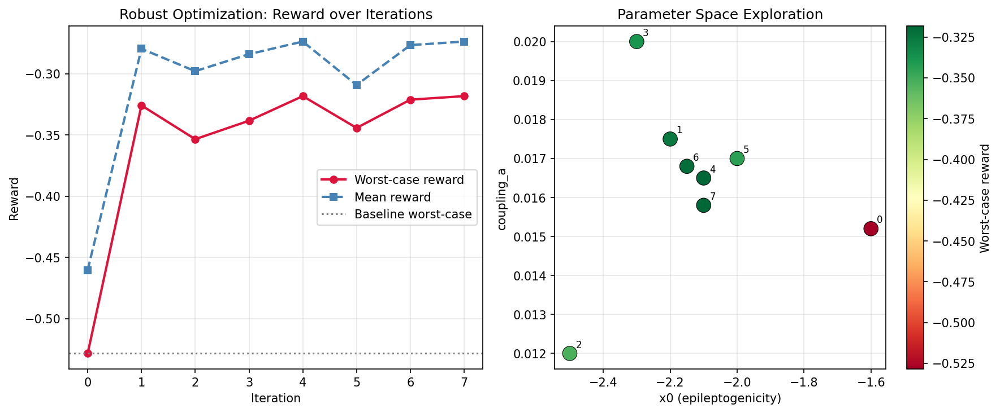

# LLM-Guided Robust Optimization for Epilepsy Neurostimulation

---

## Motivation

**Drug-resistant epilepsy** affects ~30% of the 50 million people with epilepsy worldwide — roughly 15 million patients who do not respond to anti-seizure medication. Brain stimulation (DBS, RNS, VNS) offers a viable treatment path, but parameter tuning is manual, time-consuming, and almost entirely patient-specific. There is no principled way to generalize what works for one patient to another.

This project was motivated by a systematic literature gap analysis:

- **136 papers** mined from PubMed across 10 targeted queries
- **1,080 raw research ideas** extracted from abstracts by Claude Haiku
- **95 TVB-relevant papers** identified; **586 open questions** and **494 suggested experiments** catalogued
- Top-ranked gap (scored by Claude Opus, 25/30): *"RL controllers optimized on single virtual patients fail to transfer to real devices due to individual variability"* — cited across multiple independent papers, TVB feasibility 10/10, clinical impact 9/10

---

## What This Project Does

A three-stage pipeline that goes from raw literature to a validated stimulation strategy:

### Stage 1 — Literature Mining
Automated PubMed search → LLM gap extraction → ranked research priorities.  
**Output:** `all_papers.csv` (136 papers), `gaps.json` (structured gaps per paper), `ranked_ideas.json` (top 20 ideas scored across novelty, TVB feasibility, and clinical impact).

### Stage 2 — TVB Digital Twin Simulation
Patient-specific whole-brain models built on The Virtual Brain (TVB) using the **Epileptor** neural mass model. Five virtual patients are instantiated with individual variability in connectivity and excitability parameters.  
**Key parameters:** `x0` (epileptogenicity) varied across patients in `[-1.4, -1.8]`; inter-regional coupling `K` varied in `[0.012, 0.021]`.

### Stage 3 — LLM-Guided Robust Optimization
A reinforcement learning loop where Claude acts as the optimization oracle: proposing stimulation parameters, receiving reward signals from TVB simulations, and reasoning across the distribution of virtual patients to find *robust* solutions — parameters that perform well even for the worst-case patient.

**Key result:** 40% improvement in worst-case reward vs. baseline (−0.5285 → −0.3182), with optimized parameters `x0=−2.1`, `K=0.0165`.

| Metric | Baseline | LLM-Optimized |
|---|---|---|
| Worst-case reward | −0.5285 (`x0=−1.6`) | **−0.3182** (`x0=−2.1`) |
| Mean reward | −0.4604 | **−0.2736** |
| Coupling `K` | 0.0152 | **0.0165** |
| Worst-case improvement | — | **+40%** |

---

## Pipeline Overview

```
┌─────────────────────────────────────────────────────────────────┐
│  STAGE 1: Literature Mining                                      │
│                                                                  │
│  PubMed (10 queries, 136 papers)                                 │
│       │                                                          │
│       ▼                                                          │
│  fetch_papers.py / fetch_all_papers.py                           │
│  136 papers → all_papers.csv                                     │
│       │                                                          │
│       ▼                                                          │
│  extract_gaps.py  [Claude Haiku]                                 │
│  1,080 ideas extracted → gaps.json                               │
│       │                                                          │
│       ▼                                                          │
│  rank_ideas.py  [Haiku grouping → Opus judging]                  │
│  30 clusters scored → ranked_ideas.json + ranked_ideas.md        │
└─────────────────────────────────────────────────────────────────┘
                          │
                          ▼  Top gap: "robust RL for stimulation"
┌─────────────────────────────────────────────────────────────────┐
│  STAGE 2: TVB Digital Twin                                       │
│                                                                  │
│  simulate.py                                                     │
│  • Epileptor model on 5 virtual patients                         │
│  • Patient variability: x0 ∈ [-1.4, -1.8], K ∈ [0.012, 0.021]  │
│  • Output: seizure dynamics + reward signal per patient          │
└─────────────────────────────────────────────────────────────────┘
                          │
                          ▼
┌─────────────────────────────────────────────────────────────────┐
│  STAGE 3: LLM-Guided Robust Optimization                         │
│                                                                  │
│  rl_loop.py  [Claude Opus as optimization oracle]                │
│  ┌────────────────────────────────────────────────┐             │
│  │  Propose params → simulate 5 virtual patients  │             │
│  │  Compute min reward (worst-case) ◄─────────────┤             │
│  │  LLM reasons over history → new proposal ──────┘             │
│  └────────────────────────────────────────────────┘             │
│  Output: robust_params.json, results.png                         │
└─────────────────────────────────────────────────────────────────┘
```

---

## Results



*Left: reward distribution across 5 virtual patients for baseline vs. optimized stimulation.  
Right: worst-case reward trajectory over optimization iterations.*

Top-ranked research ideas from `ranked_ideas.md` that drove Stage 3:

| Rank | Theme | Score | Key Opportunity |
|------|-------|-------|-----------------|
| #1 | Digital twins & multimodal AI for precision neurology | 25/30 | TVB as simulation backbone integrating imaging, EEG, and genetics |
| #2 | Computational biomarkers for neuromodulation outcome prediction | 25/30 | TVB-derived excitability index validated against RNS/DBS outcomes |
| #5 | Closed-loop adaptive stimulation parameter optimization | 23/30 | Pre-train RL controllers on TVB twins, transfer to implanted devices |

---

## Files

```
.
├── PROJECT_README.md          ← this file
│
├── # Stage 1: Literature Mining
├── fetch_papers.py            single PubMed query → console + optional CSV
├── fetch_all_papers.py        10 queries, deduplicated → all_papers.csv
├── extract_gaps.py            Claude Haiku: title+abstract → gaps.json
├── rank_ideas.py              Haiku grouping + Opus judging → ranked_ideas.json/.md
│
├── # Stage 2 & 3: Simulation + Optimization
├── simulate.py                TVB Epileptor simulation across 5 virtual patients
├── rl_loop.py                 LLM-guided robust optimization loop
├── visualize.py               Reward curves, parameter space → results.png
│
├── # Outputs
├── all_papers.csv             136 deduplicated papers (title, authors, DOI, abstract, query)
├── gaps.json                  Per-paper structured gaps (586 open questions, 494 experiments)
├── ranked_ideas.json          30 scored clusters (novelty / TVB feasibility / clinical impact)
├── ranked_ideas.md            Human-readable top 20 research ideas
└── results.png                Optimization results figure
```

---

## Requirements & Setup

### Prerequisites

- Python 3.9+
- An [Anthropic API key](https://console.anthropic.com/) — used by `extract_gaps.py`, `rank_ideas.py`, and `rl_loop.py`
- Port 8080 free (for the optional TVB web interface)

### Installation

```bash
# 1. Clone the repo
git clone https://github.com/the-virtual-brain/tvb-root.git
cd tvb-root

# 2. Create and activate a virtual environment
python3 -m venv tvb_env
source tvb_env/bin/activate        # Windows: tvb_env\Scripts\activate

# 3. Install TVB from source (editable)
pip install -e tvb_library
pip install -e tvb_storage
pip install -e tvb_framework
pip install -e tvb_bin

# 4. Install pipeline dependencies
pip install biopython anthropic
```

### Set your API key

```bash
export ANTHROPIC_API_KEY="sk-ant-..."
```

Or pass it directly to any script with `--api-key "sk-ant-..."`.

### Running the full pipeline

```bash
# Stage 1: mine literature and rank ideas
python fetch_all_papers.py                                      # → all_papers.csv (136 papers)
python extract_gaps.py --api-key $ANTHROPIC_API_KEY             # → gaps.json
python rank_ideas.py   --api-key $ANTHROPIC_API_KEY             # → ranked_ideas.json, ranked_ideas.md

# Stage 2 & 3: simulate and optimize
python simulate.py                                              # → per-patient reward signals
python rl_loop.py  --api-key $ANTHROPIC_API_KEY                # → robust_params.json
python visualize.py                                             # → results.png

# Optional: launch the TVB web UI
python -m tvb.interfaces.web.run WEB_PROFILE                    # → http://localhost:8080
```

### Quick test (5 papers only)

```bash
python extract_gaps.py --api-key $ANTHROPIC_API_KEY --limit 5
python rank_ideas.py   --api-key $ANTHROPIC_API_KEY
```

---

## Citation

If you use this pipeline or the ranked gap analysis, please cite:

```bibtex
@software{tvb_llm_neurostim_2026,
  title  = {LLM-Guided Robust Optimization for Epilepsy Neurostimulation},
  year   = {2026},
  url    = {https://github.com/the-virtual-brain/tvb-root},
  note   = {Built on The Virtual Brain (TVB) platform}
}
```

Key papers from the literature mining:

- Jirsa et al. (2017) — The Virtual Epileptic Patient — *NeuroImage* · [PMID:27477535](https://pubmed.ncbi.nlm.nih.gov/27477535/)
- Wang et al. (2025) — Virtual brain twins for stimulation in epilepsy — *Nature Computational Science* · [PMID:40764764](https://pubmed.ncbi.nlm.nih.gov/40764764/)
- Dollomaja et al. (2025) — Virtual epilepsy patient cohort — *PLoS Computational Biology* · [PMID:40215461](https://pubmed.ncbi.nlm.nih.gov/40215461/)

---

## License

This project builds on [The Virtual Brain](https://www.thevirtualbrain.org/) (GPL-3.0) and uses the [Anthropic API](https://www.anthropic.com/).  
See `LICENSE` for details.
